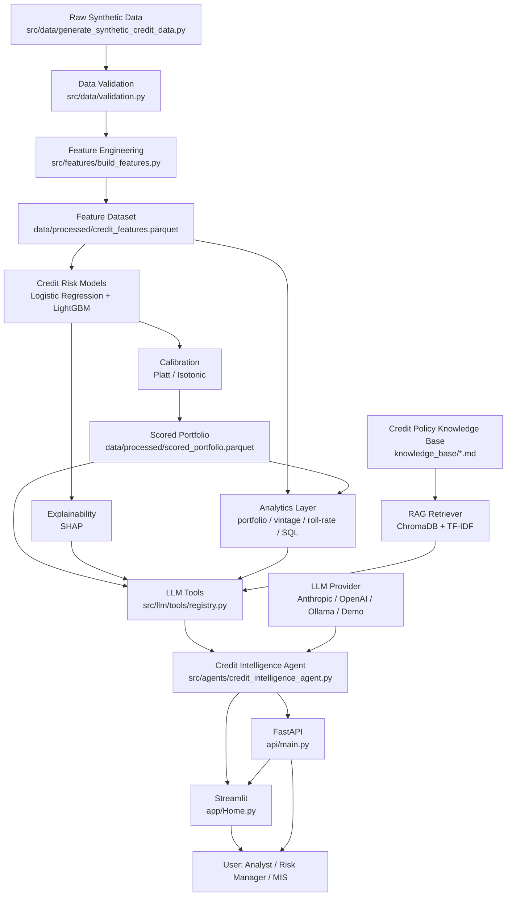
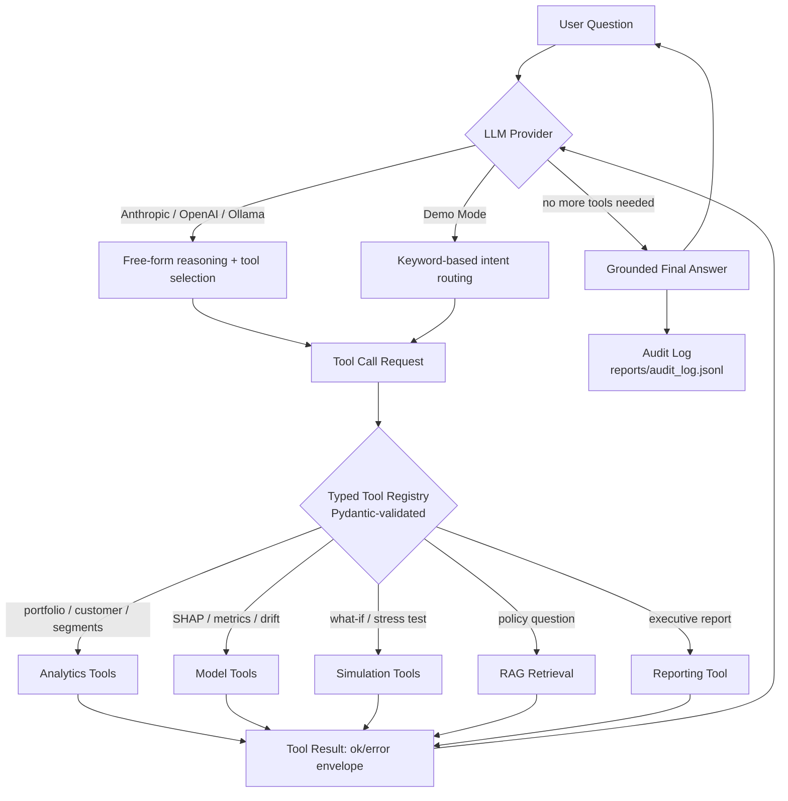

# Architecture

## System Architecture



## GenAI Architecture: Agent Workflow



### Why not LangGraph

`langgraph`/`langchain-core` were initially added as dependencies per the
spec's suggestion. During implementation, the installed release was a
very recent 1.x line with API surfaces still evolving fast, and this
project's priority is a demo that **runs reliably offline for any
recruiter**, without chasing framework version drift. The agent loop above
is implemented directly as a small, fully-tested Python state machine
(`CreditIntelligenceAgent.ask`) with the exact same conceptual shape a
LangGraph `StateGraph` would encode: intent → tool call(s) → evidence
aggregation → guardrail (system prompt + SQL guard + tool schema
validation) → response. The dependencies were removed
(`git log` — see the "fix: prefer smooth Platt-scaling..." commit) once
this was confirmed. This is a documented engineering trade-off, not an
oversight — see [`GOVERNANCE.md`](GOVERNANCE.md) for how architectural
decisions are recorded in this project.

## Data Flow

1. `make data` generates the synthetic portfolio (customer snapshot +
   monthly performance panel).
2. `make validate` runs the pandera schema + business-rule checks.
3. `make features` engineers risk indicators and assigns the temporal
   train/validation/test split.
4. `make train` trains Logistic Regression + LightGBM, evaluates both on
   all three splits, and logs everything to MLflow.
5. Calibration (`src.models.calibration`) fits Platt/isotonic on the
   validation split and picks the smoother option unless isotonic wins
   materially.
6. `src.risk.scorebook` applies the calibrated champion across the full
   dataset, converts PD → score → band, and computes Expected Loss →
   `data/processed/scored_portfolio.parquet`.
7. Analytics (`src.analytics.*`), monitoring (`src.monitoring.drift`), and
   the SQL data mart (`sql/*.sql`) all read from that single scored
   portfolio + the feature dataset, so every surface (API, dashboard,
   agent) reports identical numbers.
8. The LLM tool registry wraps all of the above in typed, validated
   functions; the agent orchestrates provider ↔ tools; FastAPI and
   Streamlit both sit on top of the same tool registry and analytics
   functions.

## Data Mart (dimensional model)

See [`docs/DATA_MART.md`](docs/DATA_MART.md) for the full ERD and the
mapping from logical fact/dimension tables to physical parquet files and
DuckDB views.

## Modular Repository Layout

```text
src/
    data/        generation + pandera/business-rule validation
    features/    feature engineering + temporal split
    models/      training, metrics, calibration, SHAP explainability
    risk/        PD -> score -> band, Expected Loss, stress testing/what-if, scorebook
    analytics/   portfolio KPIs, vintage/MOB, roll-rate, SQL runner
    monitoring/  PSI drift, performance-over-time
    rag/         knowledge-base chunking, TF-IDF embeddings, retrieval
    llm/         provider abstraction, typed tools, system prompt, audit log
    agents/      the Credit Intelligence Agent orchestrator
    reporting/   executive report generator
    utils/       config, structured logging
api/            FastAPI app + routers + schemas
app/            Streamlit dashboard (Home + 12 pages) + shared theme/loaders
sql/            data-mart views + report queries (DuckDB)
knowledge_base/ synthetic credit policy documents (RAG source)
tests/          unit/ + integration/
```
