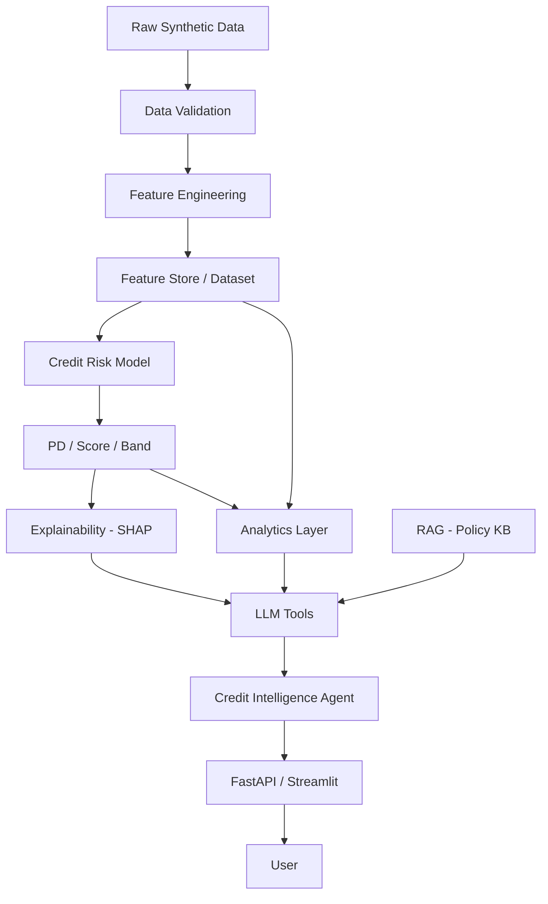

# Credit Intelligence AI

**Explainable credit risk intelligence — quantitative models, generative AI, and human oversight, working together.**

[Português](README.pt-BR.md) | English


---

## For Recruiters (60 seconds)

**Business problem.** Monitoring credit risk requires combining behavioral
data, quantitative models, and policy — most portfolio projects show only
one of these in isolation.

**Solution.** A Credit Intelligence platform that combines Machine
Learning, Explainable AI, and Generative AI to help credit analysts and
risk managers investigate a portfolio, a customer, or a scenario in
natural language.

**The differentiator.** The LLM never replaces the quantitative model. It
sits on top of it as an interpretation and investigation layer — over
models, portfolio data, policies, and simulations — always citing tool
output, never fabricating a number, and never issuing a credit decision.

**What you'll find if you dig in:**

| Area | Where |
|---|---|
| Data engineering | `src/data/`, `src/features/`, 100k-row synthetic generator with realistic noise/missingness/temporal drift |
| Credit risk modeling | `src/models/` — Logistic Regression + LightGBM, calibrated, OOT-validated (real AUC ≈0.836, not an inflated 0.95+) |
| Explainable AI | `src/models/explainability.py` — SHAP, per-customer and global |
| Generative AI / Agentic | `src/agents/`, `src/llm/` — multi-provider (Anthropic/OpenAI/Ollama/offline Demo Mode), 13 typed tools, guarded SQL, RAG |
| Analytics / MIS | `src/analytics/`, `sql/` — portfolio KPIs, vintage/MOB, roll-rate, a real DuckDB data mart |
| MLOps | MLflow tracking, champion/challenger comparison, drift monitoring (PSI) |
| Governance | `MODEL_CARD.md`, `DATA_CARD.md`, `GOVERNANCE.md`, `RESPONSIBLE_AI.md` |
| Engineering rigor | 153 tests (84% coverage), typed Python, CI (lint + secret scan + tests + Docker build), FastAPI + Streamlit |

**Demo in under 5 minutes, no API key required:**

```bash
git clone https://github.com/matheusandrean/credit-intelligence-ai.git
cd credit-intelligence-ai
make install
make data && make features && make train
make app   # Streamlit dashboard at http://localhost:8501
```

---

## Overview

Credit Intelligence AI is a decision-**support** platform for credit
analysts, risk managers, and MIS teams. It combines:

- A **quantitative layer**: Logistic Regression + LightGBM models
  producing calibrated Probability of Default (PD), an illustrative
  300-900 score, A-E risk bands, and Expected Loss.
- An **explainability layer**: SHAP-based drivers for every prediction,
  local and global.
- A **generative AI layer**: an agent that interprets, compares, simulates,
  and cites policy — always grounded in tool output, never approving or
  denying credit.

See [`docs/PORTFOLIO_STORY.md`](docs/PORTFOLIO_STORY.md) for the full
narrative this project is built to tell.

## Business Problem

A real credit portfolio generates far more signal than any single
dashboard or model score communicates: behavioral trends, cohort effects,
delinquency migration, model drift, and policy context all matter
together. Analysts need a way to investigate all of it quickly, without
either (a) trusting an opaque black-box score, or (b) trusting an LLM that
might confidently invent a number.

## Architecture



Full architecture, the agent-workflow diagram, and the "why not LangGraph"
engineering decision: see [`ARCHITECTURE.md`](ARCHITECTURE.md).

## Key Features

- Synthetic, realistic 100k-customer credit portfolio (no real data, ever)
- Temporal (out-of-time) train/validation/test split — not a random split
- Two models compared head-to-head (champion/challenger), never accuracy alone
- Calibrated PD (Platt/isotonic, validation-only fit)
- SHAP explainability, local + global, human-readable (no leaked encodings)
- Portfolio KPIs, segment comparison, vintage/MOB, roll-rate analysis
- A real SQL data mart (DuckDB) with 6 verified report queries
- Stress testing (4 scenarios) and single-customer what-if simulation
- PSI-based drift monitoring, feature-level and predicted-PD-level
- RAG over 5 synthetic credit-policy documents, with citations
- A multi-provider AI Credit Analyst agent (Anthropic/OpenAI/Ollama/Demo)
- 13 typed, Pydantic-validated tools; guarded read-only SQL tool
- A Portfolio Executive Report generator (built entirely from other tools)
- Full audit logging of every agent interaction
- FastAPI (10 endpoints, OpenAPI docs) + Streamlit (12 pages)
- 153 tests, 84% coverage, CI with lint + secret scan + dependency audit

## Stack

| Layer | Tools |
|---|---|
| Language | Python 3.12 |
| Data | pandas, numpy, pyarrow, DuckDB |
| Validation | pandera |
| ML | scikit-learn, LightGBM |
| Explainability | SHAP |
| MLOps | MLflow (SQLite backend) |
| LLM | Anthropic, OpenAI, Ollama (+ offline Demo Mode) |
| RAG | ChromaDB + TF-IDF (offline, no model download) |
| API | FastAPI |
| Dashboard | Streamlit + Plotly |
| Tests | pytest, pytest-cov |
| Quality | Ruff, Black, mypy |
| CI/CD | GitHub Actions |
| Containers | Docker, docker-compose |

## Data Flow

`make data` → `make validate` → `make features` → `make train` →
calibration → scored portfolio → analytics/monitoring/SQL/agent — see
[`ARCHITECTURE.md`](ARCHITECTURE.md#data-flow) for the full sequence and
[`DATA_CARD.md`](DATA_CARD.md) for how the synthetic data itself is built.

## Modeling Approach

- **Baseline**: Logistic Regression (interpretable, `class_weight=balanced`).
- **Challenger**: LightGBM (non-linear, early-stopped).
- **Split**: strict temporal train (2023-01→2024-06) / validation
  (2024-07→2024-12) / test (2025-01→2025-06) — see
  [`docs/TEMPORAL_VALIDATION.md`](docs/TEMPORAL_VALIDATION.md).
- **Evaluation**: ROC-AUC, PR-AUC, KS, Gini, Brier, lift/recall at top
  deciles — never accuracy alone on this ~7.5%-base-rate problem.
- **Calibration**: Platt scaling preferred by default over isotonic
  regression unless isotonic wins by a material margin, specifically to
  keep the what-if/stress-testing tools sensitive to small input changes
  (a documented trade-off — see [`MODEL_CARD.md`](MODEL_CARD.md)).

## Model Results (real, measured)

From `reports/model_comparison.json` — regenerate yourself with `make train`:

| Metric (OOT test) | Logistic Regression (champion) | LightGBM (challenger) |
|---|---:|---:|
| ROC-AUC | **0.8357** | 0.8339 |
| Gini | 0.6715 | 0.6679 |
| KS statistic | 0.5259 | 0.5243 |
| Brier (raw → calibrated) | 0.1816 → **0.0655** | — |
| Lift @ top decile | 3.98x | 3.97x |

Full metrics, champion-selection rule, and caveats:
[`MODEL_CARD.md`](MODEL_CARD.md).

## Explainable AI

Every PD is explainable — top-5 risk-increasing and top-5 risk-reducing
factors, with real observed values (not scaled/encoded internals). Global
top drivers on the last run: `debt_to_income`, `behavioral_score`,
`late_payments_12m`, `utilization_gap_to_limit`, `financial_stability_index`.
See `app/pages/4_Customer_360.py` and `app/pages/9_Model_Performance.py`.

## GenAI Architecture

See the agent-workflow Mermaid diagram in [`ARCHITECTURE.md`](ARCHITECTURE.md#genai-architecture-agent-workflow).
In short: question → provider (real LLM or Demo Mode routing) → typed tool
call(s) → results → grounded final answer → audit log. The system prompt
(`src/llm/system_prompt.py`) enforces 12 explicit anti-hallucination and
human-in-the-loop rules.

## RAG

5 synthetic, clearly-labeled `SYNTHETIC DEMONSTRATION POLICY` documents in
`knowledge_base/`, chunked by section, embedded with an offline TF-IDF
vectorizer, stored in ChromaDB. Every retrieval result cites
`Document > Section`; retrieved text is always treated as data, never as
instructions (prompt-injection defense) — see
[`RESPONSIBLE_AI.md`](RESPONSIBLE_AI.md).

## Example Questions

```text
What is the current risk profile of the portfolio?
Which factors are driving default risk?
Compare risk bands A and D.
Explain customer CUST_000123's risk profile.
What happens under the severe stress scenario?
What are the main model drift indicators?
Summarize the portfolio for a Credit Risk Director.
```

```text
Qual o perfil dos clientes de maior risco?
Quais fatores mais contribuíram para o aumento da PD?
O que aconteceria com a carteira se a renda dos clientes caísse 10%?
Qual política trata clientes com comprometimento elevado?
Gere um resumo executivo da carteira.
```

More in `app/pages/5_AI_Credit_Analyst.py` and
`evaluation/credit_questions.json` (the golden evaluation set — 15/15
tool-selection accuracy, see [`docs/LLM_EVALUATION.md`](docs/LLM_EVALUATION.md)).

## Stress Testing

4 scenarios (Baseline/Mild/Moderate/Severe), sharing one shock mechanic
with the single-customer what-if tool. Last run: severe scenario moves
average PD from 7.46% to 10.27% (+2.81pp) — see
`reports/stress_test_report.json` and `app/pages/6_Portfolio_Stress_Testing.py`.

## Monitoring

Population Stability Index (PSI) on both input features and the predicted
PD distribution over time, with Stable/Monitor/Significant-drift
thresholds (demonstrative — see [`GOVERNANCE.md`](GOVERNANCE.md)). Vintage
and roll-rate analysis localize deterioration signals to specific cohorts
or delinquency transitions. See `app/pages/10_Model_Monitoring.py`.

## Governance

[`MODEL_CARD.md`](MODEL_CARD.md) · [`DATA_CARD.md`](DATA_CARD.md) ·
[`GOVERNANCE.md`](GOVERNANCE.md) · [`RESPONSIBLE_AI.md`](RESPONSIBLE_AI.md) ·
[`docs/LIMITATIONS.md`](docs/LIMITATIONS.md) (reject inference, no
independent validation, illustrative bands, and more — stated explicitly).

## Responsible AI

No protected/sensitive characteristic is ever used or inferable (enforced
by automated validation, not just a promise). No component approves,
denies, or overrides a credit decision. Every LLM claim is tool-grounded.
Full detail: [`RESPONSIBLE_AI.md`](RESPONSIBLE_AI.md).

## How to Run

### Prerequisites

- Python 3.12+
- (Optional) Docker + Docker Compose
- (Optional) an Anthropic/OpenAI API key, or a local Ollama install — none
  required for full functionality, see [`docs/DEMO_MODE.md`](docs/DEMO_MODE.md)

### Local install

```bash
git clone https://github.com/matheusandrean/credit-intelligence-ai.git
cd credit-intelligence-ai
cp .env.example .env          # defaults to LLM_PROVIDER=demo, no key needed

make install                  # creates .venv, installs deps, sets up pre-commit
make data                     # generates the synthetic portfolio
make validate                 # runs the data-quality suite
make features                 # engineers features + temporal split
make train                    # trains + evaluates + calibrates + scores
make test                     # 153 tests
```

Windows (PowerShell), equivalent commands:

```powershell
.\scripts\tasks.ps1 install
.\scripts\tasks.ps1 data
.\scripts\tasks.ps1 validate
.\scripts\tasks.ps1 features
.\scripts\tasks.ps1 train
.\scripts\tasks.ps1 test
```

### Run the app

```bash
make app     # Streamlit dashboard -> http://localhost:8501
make api     # FastAPI -> http://localhost:8000/docs
```

### Docker

```bash
cp .env.example .env
docker compose up
# pipeline runs once, then api (:8000) and app (:8501) start
```

> **Environment note**: this project was developed and verified in a
> Windows sandbox without a local Docker daemon available, so the
> `docker compose up` path is verified by Dockerfile/compose-file review
> and a successful `docker compose build`-equivalent CI job
> (`.github/workflows/ci.yml`), not by a full local `docker compose up`
> run. Every other command above (`make data/validate/features/train/test`,
> `make api`, `make app`, the FastAPI TestClient suite, and a live
> `streamlit run`/`uvicorn` smoke test) was executed directly and verified
> in this environment.

### Enabling a real LLM provider

```bash
# .env
LLM_PROVIDER=anthropic
ANTHROPIC_API_KEY=sk-ant-...
```

See [`docs/DEMO_MODE.md`](docs/DEMO_MODE.md) for OpenAI/Ollama setup.

## API

FastAPI with automatic OpenAPI docs at `/docs`:

```text
GET  /health
GET  /portfolio/summary
GET  /customer/{customer_id}
GET  /customer/{customer_id}/risk
GET  /customer/{customer_id}/explanation
GET  /model/metrics
GET  /monitoring/drift
POST /simulation/what-if
POST /stress-test
POST /ai/chat
```

## Testing

```bash
make test
```

153 tests (unit + integration), 84% coverage across `src/` and `api/`. CI
(`.github/workflows/ci.yml`) runs lint (Ruff), format check (Black),
secret scanning (detect-secrets), dependency audit (pip-audit), the full
test suite with coverage, and a Docker build — on every push and PR.

## Roadmap

- [ ] Reject-inference discussion → concrete methodology (currently
      documented as an explicit limitation, not implemented)
- [ ] Champion/challenger A/B shadow-scoring over live traffic
- [ ] Neural embedding option for RAG when network access is assumed
      available (currently TF-IDF by design, for offline Demo Mode)
- [ ] Dedicated `GET /reports/executive` API endpoint (currently
      chat/dashboard-only)
- [ ] CI job to auto-refresh `reports/*.json` and README metrics on
      schedule

## Disclaimer

This is a **portfolio/educational project**. It must not be used to make
real credit decisions about real people without independent validation,
governance, compliance, and legal review specific to the deploying
institution. All data is synthetic. See [`LICENSE`](LICENSE) and
[`RESPONSIBLE_AI.md`](RESPONSIBLE_AI.md).

## Author

**Matheus Marcondes** — MIS Analyst, building toward Credit Risk /
Analytics / Data Science. This project demonstrates end-to-end ownership
of a Credit Intelligence platform: data engineering, credit risk modeling,
explainable AI, generative AI, MLOps, and governance.
