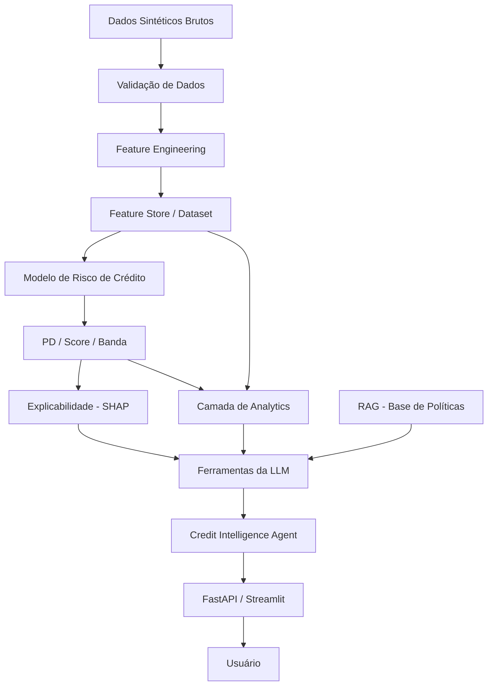

# Credit Intelligence AI

**Inteligência de risco de crédito explicável — modelos quantitativos, IA generativa e supervisão humana, trabalhando juntos.**

Português | [English](README.md)


---

## Para Recrutadores (60 segundos)

**Problema de negócio.** Monitorar risco de crédito exige combinar dados
comportamentais, modelos quantitativos e políticas — a maioria dos
projetos de portfólio mostra apenas um desses elementos isoladamente.

**Solução.** Uma plataforma de Credit Intelligence que combina Machine
Learning, Explainable AI e IA Generativa para ajudar analistas de crédito
e gestores de risco a investigar a carteira, um cliente ou um cenário em
linguagem natural.

**O diferencial.** A LLM nunca substitui o modelo quantitativo. Ela atua
como uma camada de interpretação e investigação sobre modelos, dados de
carteira, políticas e simulações — sempre citando a saída das ferramentas,
nunca inventando um número, e nunca emitindo uma decisão de crédito.

**O que você vai encontrar se explorar o repositório:**

| Área | Onde |
|---|---|
| Engenharia de dados | `src/data/`, `src/features/` — gerador sintético de 100 mil registros com ruído, missing e deriva temporal realistas |
| Modelagem de risco de crédito | `src/models/` — Logistic Regression + LightGBM, calibrados, validados out-of-time (AUC real ≈0,836, não um 0,95+ inflado) |
| Explainable AI | `src/models/explainability.py` — SHAP, por cliente e global |
| IA Generativa / Agentic | `src/agents/`, `src/llm/` — multi-provider (Anthropic/OpenAI/Ollama/Demo Mode offline), 13 ferramentas tipadas, SQL protegido, RAG |
| Analytics / MIS | `src/analytics/`, `sql/` — KPIs de carteira, vintage/MOB, roll-rate, um data mart real em DuckDB |
| MLOps | Tracking em MLflow, comparação champion/challenger, monitoramento de drift (PSI) |
| Governança | `MODEL_CARD.md`, `DATA_CARD.md`, `GOVERNANCE.md`, `RESPONSIBLE_AI.md` |
| Rigor de engenharia | 153 testes (84% de cobertura), Python tipado, CI (lint + secret scan + testes + build Docker), FastAPI + Streamlit |

**Demo em menos de 5 minutos, sem precisar de API key:**

```bash
git clone https://github.com/matheusandrean/credit-intelligence-ai.git
cd credit-intelligence-ai
make install
make data && make features && make train
make app   # Dashboard Streamlit em http://localhost:8501
```

---

## Visão Geral

Credit Intelligence AI é uma plataforma de **apoio à decisão** para
analistas de crédito, gestores de risco e times de MIS. Combina:

- **Camada quantitativa**: modelos de Logistic Regression + LightGBM
  produzindo Probability of Default (PD) calibrada, um score ilustrativo
  de 300-900, bandas de risco A-E e Expected Loss.
- **Camada de explicabilidade**: fatores baseados em SHAP para cada
  previsão, local e globalmente.
- **Camada de IA generativa**: um agente que interpreta, compara, simula e
  cita políticas — sempre fundamentado na saída das ferramentas, nunca
  aprovando ou negando crédito.

Veja [`docs/PORTFOLIO_STORY.md`](docs/PORTFOLIO_STORY.md) para a narrativa
completa que este projeto foi construído para contar.

## Problema de Negócio

Uma carteira de crédito real gera muito mais sinal do que qualquer
dashboard ou score isolado comunica: tendências comportamentais, efeitos
de safra, migração de inadimplência, drift de modelo e contexto de
políticas importam em conjunto. Analistas precisam investigar tudo isso
rapidamente, sem (a) confiar em um score opaco tipo caixa-preta, nem
(b) confiar em uma LLM que pode inventar um número com confiança.

## Arquitetura



Arquitetura completa, diagrama do fluxo do agente e a decisão de
engenharia "por que não LangGraph": veja [`ARCHITECTURE.md`](ARCHITECTURE.md)
(em inglês).

## Principais Funcionalidades

- Carteira sintética realista de 100 mil clientes (nunca dados reais)
- Split temporal (out-of-time) treino/validação/teste — não um split aleatório
- Dois modelos comparados lado a lado (champion/challenger), nunca só accuracy
- PD calibrada (Platt/isotônica, ajustada somente na validação)
- Explicabilidade SHAP, local e global, legível por humanos
- KPIs de carteira, comparação de segmentos, vintage/MOB, roll-rate
- Um data mart SQL real (DuckDB) com 6 queries de relatório verificadas
- Stress testing (4 cenários) e simulação what-if por cliente
- Monitoramento de drift baseado em PSI, por feature e por PD prevista
- RAG sobre 5 documentos sintéticos de política de crédito, com citações
- Um agente AI Credit Analyst multi-provider (Anthropic/OpenAI/Ollama/Demo)
- 13 ferramentas tipadas e validadas por Pydantic; SQL protegido e somente leitura
- Gerador de Relatório Executivo de Carteira (construído a partir de outras ferramentas)
- Log de auditoria completo de cada interação do agente
- FastAPI (10 endpoints, docs OpenAPI) + Streamlit (12 páginas)
- 153 testes, 84% de cobertura, CI com lint + secret scan + auditoria de dependências

## Stack Tecnológica

| Camada | Ferramentas |
|---|---|
| Linguagem | Python 3.12 |
| Dados | pandas, numpy, pyarrow, DuckDB |
| Validação | pandera |
| ML | scikit-learn, LightGBM |
| Explicabilidade | SHAP |
| MLOps | MLflow (backend SQLite) |
| LLM | Anthropic, OpenAI, Ollama (+ Demo Mode offline) |
| RAG | ChromaDB + TF-IDF (offline, sem download de modelo) |
| API | FastAPI |
| Dashboard | Streamlit + Plotly |
| Testes | pytest, pytest-cov |
| Qualidade | Ruff, Black, mypy |
| CI/CD | GitHub Actions |
| Containers | Docker, docker-compose |

## Fluxo de Dados

`make data` → `make validate` → `make features` → `make train` →
calibração → carteira scored → analytics/monitoramento/SQL/agente — veja
[`ARCHITECTURE.md`](ARCHITECTURE.md#data-flow) para a sequência completa e
[`DATA_CARD.md`](DATA_CARD.md) para como os dados sintéticos são gerados.

## Abordagem de Modelagem

- **Baseline**: Logistic Regression (interpretável, `class_weight=balanced`).
- **Challenger**: LightGBM (não linear, com early stopping).
- **Split**: temporal estrito — treino (2023-01→2024-06) / validação
  (2024-07→2024-12) / teste (2025-01→2025-06) — veja
  [`docs/TEMPORAL_VALIDATION.md`](docs/TEMPORAL_VALIDATION.md).
- **Avaliação**: ROC-AUC, PR-AUC, KS, Gini, Brier, lift/recall nos maiores
  decis — nunca apenas accuracy neste problema com ~7,5% de taxa base.
- **Calibração**: Platt scaling é preferido por padrão em relação à
  regressão isotônica, a menos que a isotônica ganhe por margem
  relevante — especificamente para manter as ferramentas de what-if e
  stress test sensíveis a pequenas mudanças de entrada (trade-off
  documentado — veja [`MODEL_CARD.md`](MODEL_CARD.md)).

## Resultados do Modelo (reais, medidos)

De `reports/model_comparison.json` — reproduza você mesmo com `make train`:

| Métrica (teste OOT) | Logistic Regression (champion) | LightGBM (challenger) |
|---|---:|---:|
| ROC-AUC | **0,8357** | 0,8339 |
| Gini | 0,6715 | 0,6679 |
| KS statistic | 0,5259 | 0,5243 |
| Brier (bruto → calibrado) | 0,1816 → **0,0655** | — |
| Lift no decil superior | 3,98x | 3,97x |

Métricas completas, regra de seleção do champion e ressalvas:
[`MODEL_CARD.md`](MODEL_CARD.md).

## Explainable AI

Toda PD é explicável — top-5 fatores que aumentam e top-5 que reduzem o
risco, com valores reais observados (não valores padronizados/codificados
internos). Principais fatores globais na última execução:
`debt_to_income`, `behavioral_score`, `late_payments_12m`,
`utilization_gap_to_limit`, `financial_stability_index`.

## Arquitetura de GenAI

Veja o diagrama Mermaid do fluxo do agente em
[`ARCHITECTURE.md`](ARCHITECTURE.md#genai-architecture-agent-workflow). Em
resumo: pergunta → provider (LLM real ou roteamento do Demo Mode) →
chamada(s) de ferramenta tipada(s) → resultados → resposta final
fundamentada → log de auditoria. O system prompt
(`src/llm/system_prompt.py`) impõe 12 regras explícitas de
anti-alucinação e human-in-the-loop.

## RAG

5 documentos sintéticos, claramente marcados como
`SYNTHETIC DEMONSTRATION POLICY`, em `knowledge_base/`, divididos por
seção, embutidos com um vetorizador TF-IDF offline, armazenados no
ChromaDB. Toda recuperação cita `Documento > Seção`; texto recuperado é
sempre tratado como dado, nunca como instrução (defesa contra prompt
injection) — veja [`RESPONSIBLE_AI.md`](RESPONSIBLE_AI.md).

## Exemplos de Perguntas

```text
Qual o perfil dos clientes de maior risco?
Quais fatores mais contribuíram para o aumento da PD?
Compare clientes das faixas A e D.
Explique por que este cliente está classificado como risco elevado.
O que aconteceria com a carteira se a renda dos clientes caísse 10%?
Quais são os principais indicadores de drift do modelo?
Gere um resumo executivo da carteira.
```

Mais exemplos em `app/pages/5_AI_Credit_Analyst.py` e
`evaluation/credit_questions.json` (o conjunto de avaliação — 15/15 de
acurácia na seleção de ferramentas, veja
[`docs/LLM_EVALUATION.md`](docs/LLM_EVALUATION.md)).

## Stress Testing

4 cenários (Baseline/Mild/Moderate/Severe), compartilhando o mesmo
mecanismo de choque com a ferramenta de what-if por cliente. Última
execução: o cenário severo move a PD média de 7,46% para 10,27%
(+2,81pp) — veja `reports/stress_test_report.json`.

## Monitoramento

Population Stability Index (PSI) tanto nas features de entrada quanto na
distribuição de PD prevista ao longo do tempo, com limiares de
Estável/Monitorar/Drift significativo (demonstrativos — veja
[`GOVERNANCE.md`](GOVERNANCE.md)). Vintage e roll-rate localizam sinais de
deterioração em safras ou transições de inadimplência específicas.

## Governança

[`MODEL_CARD.md`](MODEL_CARD.md) · [`DATA_CARD.md`](DATA_CARD.md) ·
[`GOVERNANCE.md`](GOVERNANCE.md) · [`RESPONSIBLE_AI.md`](RESPONSIBLE_AI.md) ·
[`docs/LIMITATIONS.md`](docs/LIMITATIONS.md) (reject inference, ausência de
validação independente, bandas ilustrativas, e mais — declarados
explicitamente).

## Responsible AI

Nenhuma característica protegida/sensível é usada ou inferível (garantido
por validação automatizada, não apenas uma promessa). Nenhum componente
aprova, nega ou sobrescreve uma decisão de crédito. Toda afirmação da LLM
é fundamentada em ferramentas. Detalhes completos:
[`RESPONSIBLE_AI.md`](RESPONSIBLE_AI.md).

## Como Executar

### Pré-requisitos

- Python 3.12+
- (Opcional) Docker + Docker Compose
- (Opcional) uma API key da Anthropic/OpenAI, ou uma instalação local do
  Ollama — nenhuma é necessária para funcionalidade completa, veja
  [`docs/DEMO_MODE.md`](docs/DEMO_MODE.md)

### Instalação local

```bash
git clone https://github.com/matheusandrean/credit-intelligence-ai.git
cd credit-intelligence-ai
cp .env.example .env          # padrão LLM_PROVIDER=demo, sem necessidade de key

make install                  # cria .venv, instala dependências, configura pre-commit
make data                     # gera a carteira sintética
make validate                 # roda a suíte de qualidade de dados
make features                 # engenharia de features + split temporal
make train                    # treina + avalia + calibra + pontua
make test                     # 153 testes
```

Windows (PowerShell), comandos equivalentes:

```powershell
.\scripts\tasks.ps1 install
.\scripts\tasks.ps1 data
.\scripts\tasks.ps1 validate
.\scripts\tasks.ps1 features
.\scripts\tasks.ps1 train
.\scripts\tasks.ps1 test
```

### Executando a aplicação

```bash
make app     # Dashboard Streamlit -> http://localhost:8501
make api     # FastAPI -> http://localhost:8000/docs
```

### Docker

```bash
cp .env.example .env
docker compose up
# o pipeline roda uma vez, depois api (:8000) e app (:8501) sobem
```

> **Nota sobre o ambiente**: este projeto foi desenvolvido e verificado em
> um sandbox Windows sem daemon Docker local disponível, então o caminho
> `docker compose up` foi verificado por revisão do Dockerfile/compose e
> por um job de CI equivalente a `docker compose build`
> (`.github/workflows/ci.yml`), não por uma execução local completa de
> `docker compose up`. Todos os demais comandos acima
> (`make data/validate/features/train/test`, `make api`, `make app`, a
> suíte de testes do FastAPI com TestClient, e um smoke test real de
> `streamlit run`/`uvicorn`) foram executados diretamente e verificados
> neste ambiente.

## API

FastAPI com documentação OpenAPI automática em `/docs`:

```text
GET  /health
GET  /portfolio/summary
GET  /customer/{customer_id}
GET  /customer/{customer_id}/risk
GET  /customer/{customer_id}/explanation
GET  /model/metrics
GET  /monitoring/drift
POST /simulation/what-if
POST /stress-test
POST /ai/chat
```

## Testes

```bash
make test
```

153 testes (unitários + integração), 84% de cobertura em `src/` e `api/`.
O CI (`.github/workflows/ci.yml`) roda lint (Ruff), format check (Black),
secret scanning (detect-secrets), auditoria de dependências (pip-audit), a
suíte de testes completa com cobertura, e um build Docker — em cada push e
pull request.

## Roadmap

- [ ] Discussão de reject inference → metodologia concreta (atualmente
      documentada como limitação explícita, não implementada)
- [ ] Shadow-scoring champion/challenger sobre tráfego real
- [ ] Opção de embedding neural para RAG quando acesso à rede for
      assumido disponível (atualmente TF-IDF por design, para o Demo Mode offline)
- [ ] Endpoint dedicado `GET /reports/executive` na API
- [ ] Job de CI para atualizar `reports/*.json` e métricas do README periodicamente

## Disclaimer

Este é um **projeto de portfólio/educacional**. Não deve ser usado para
tomar decisões reais de crédito sobre pessoas reais sem validação
independente, governança, compliance e revisão jurídica específicas da
instituição que o utilizar. Todos os dados são sintéticos. Veja
[`LICENSE`](LICENSE) e [`RESPONSIBLE_AI.md`](RESPONSIBLE_AI.md).

## Autor

**Matheus Marcondes** — Analista de MIS, evoluindo em direção a Crédito /
Analytics / Data Science. Este projeto demonstra domínio ponta a ponta de
uma plataforma de Credit Intelligence: engenharia de dados, modelagem de
risco de crédito, IA explicável, IA generativa, MLOps e governança.
