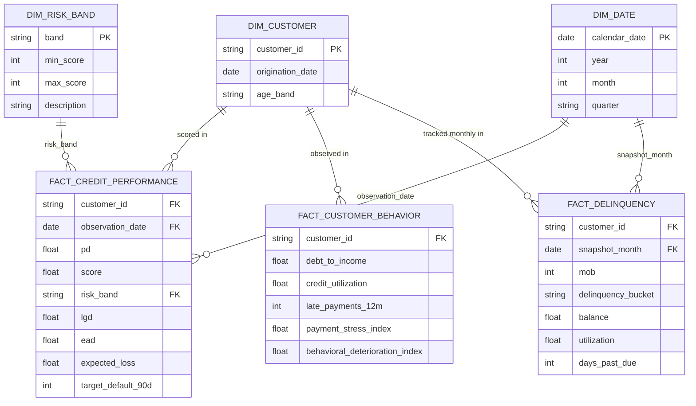

# Data Mart — Dimensional Model

Conceptual star schema over the synthetic portfolio, implemented as
DuckDB views (`sql/00_views.sql`) over the generated parquet files rather
than a physically materialized warehouse — appropriate for this
project's scale and the "everything reproducible from source" principle.

## Mapping to physical files

| Logical entity | Physical source |
|---|---|
| `fact_credit_performance` | `data/processed/scored_portfolio.parquet` (view `v_portfolio`) |
| `fact_customer_behavior` | `data/processed/credit_features.parquet` (view `v_features`) |
| `fact_delinquency` | `data/raw/monthly_performance.parquet` (view `v_monthly_performance`) |
| `dim_customer` | `data/raw/customer_portfolio.parquet` (view `v_customers`), keyed by `customer_id` |
| `dim_date` | Implicit — `observation_date`/`snapshot_month` columns, no separate materialized table |
| `dim_risk_band` | `configs/project_config.yaml::risk_bands` |

See `sql/*.sql` for report queries against this model, and
`src/analytics/run_sql_reports.py` for the runner that executes them
against real data and writes `reports/sql/*.csv`.

